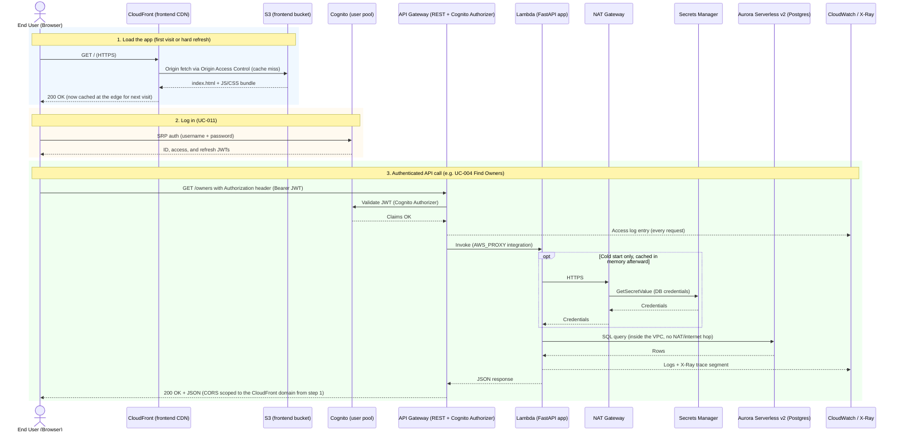

# Progress

A running status snapshot of this project, maintained by whichever AI coding tool is working in this repo — not by
hand. See the note at the bottom for how that's supposed to work.

This is a status tracker, unlike `docs/guidelines/*.md` (which are strategy/decision documents and deliberately
don't track implementation status — see `CLAUDE.md`). If you're looking for *why* something is built a certain way,
that's `architecture.md`/`testing.md`/the use case specs; this file only answers *is it built yet*.

## Current Status: What Actually Serves This Page

Every AWS service below is deployed and live in `dev` (verified in a real browser this session — see the
Infrastructure checklist further down). This traces one page load, one login, and one authenticated API call end
to end, from the browser's perspective, so "what's live right now" is a diagram, not a guess.

**Every AWS service in this diagram is used by a real, live request** — nothing here is aspirational. Three more
services exist but deliberately don't appear above because they never sit in an end user's request path:

- **IAM** — not a network hop; it authorizes every arrow above (API Gateway → Lambda, Lambda → Secrets Manager,
  Lambda → Aurora) as a policy check internal to each service.
- **A second Lambda** (the migration Lambda, `architecture.md` §2.4) — runs `alembic upgrade head` and the E2E
  test-data cleanup action, both invoked manually as deployment/maintenance steps, never by a user's browser.
- **S3 + DynamoDB for Terraform state** (`architecture.md` §4.1) — exists purely so `terraform apply` has somewhere
  to keep state and a lock table; no runtime relationship to the running application at all.

## Specifications (Steps 1–7 of README's "Spec-Driven Process")

- [x] Vision (`docs/guidelines/vision.md`)
- [x] Requirements catalog (`docs/guidelines/requirements.md`)
- [x] Entity model (`docs/guidelines/entity_model.md`)
- [x] Use case diagram (`docs/guidelines/use_cases.puml`)
- [x] Detailed use case specs, UC-001 – UC-011 (`docs/use-cases/`)
- [x] Architecture (`docs/guidelines/architecture.md`)
- [x] Testing strategy (`docs/guidelines/testing.md`)
- [x] Design system + reference mockup (`docs/guidelines/design-system.md`, `design-mockup.html`)
- [x] Construction-phase plugin for this stack (`aiup-fastapi-react/`)

## Infrastructure (Terraform, `terraform/modules/`)

- [x] Bootstrap (remote state S3 bucket + DynamoDB lock table)
- [x] Network (VPC, subnets)
- [x] Aurora (Postgres, Serverless v2)
- [x] Cognito (user pool, Clinic User provisioning, E2E test account)
- [x] Application (Lambda + API Gateway, Cognito Authorizer)
- [x] Migration Lambda (`alembic upgrade head`, deployed as a pipeline step)
- [x] Frontend hosting (S3 + CloudFront, OAC, SPA error mapping)
- [x] CORS scoped to the deployed CloudFront domain (Lambda env var + API Gateway gateway responses)
- [x] `dev` environment built and verified live at least once (frontend, API, auth all checked in a real browser)
- [ ] `dev` environment currently running — **torn down** for cost savings; see "Environment Teardown / Recreate
  Runbook" below to bring it back
- [ ] `prod` environment (not yet provisioned)
- [ ] Custom domain + ACM certificate (deferred — see `architecture.md` §0's NFR-003 TLS gap)
- [ ] CI/CD pipeline (deferred — see `architecture.md` §0; all applies so far are manual)

## Environment Teardown / Recreate Runbook

`dev`'s two always-billing pieces regardless of traffic (the NAT Gateway, Aurora Serverless v2's minimum
capacity — see README's "AWS Costs" section) make it worth tearing the whole environment down rather than
leaving it running during an extended break. This is a full `terraform destroy` of
`terraform/environments/dev` — network, Aurora, Cognito, the application layer, the migration Lambda, and the
frontend all get removed. The remote state backend (`terraform/bootstrap/dev` — the S3 bucket + DynamoDB lock
table) is intentionally left alone, so recreating is a normal `terraform apply`, not a rebuild from scratch.

**What's lost:** all Aurora data (owners/pets/visits, since `dev` skips a final snapshot on destroy) and the
Cognito user pool (any provisioned Clinic User, e.g. Maria Perez, will need a fresh temporary password emailed
again on recreate). The veterinarian directory reseeds itself automatically (it's an Alembic migration now, not
manually-entered data).

**What changes on recreate:** the frontend (`*.cloudfront.net`) and API Gateway URLs will both be different from
before — CloudFront/API Gateway don't reuse the same domain. CORS reconfigures itself automatically from the new
domain (`terraform/environments/dev/main.tf` wires `cors_allow_origin` from the frontend module's output), so
there's nothing to manually fix.

**To recreate:**

1. `cd terraform/environments/dev && ./with-creds.sh terraform init -backend-config=backend.hcl` (if the local
   `.terraform/` directory is gone)
2. `./with-creds.sh terraform apply` — recreates every module; expect the CloudFront distribution to take the
   usual several minutes to finish deploying
3. Apply the schema + seed data: invoke the migration Lambda once —
   `./with-creds.sh aws lambda invoke --function-name dev-vetonline-migration --region $(terraform output -raw aws_region) --payload '{}' --cli-binary-format raw-in-base64-out /tmp/migrate.json`
4. Get the new frontend URL: `terraform output frontend_url`
5. If a known password is wanted for a Clinic User again (rather than waiting on Cognito's invitation email),
   reset it directly: `aws cognito-idp admin-set-user-password --user-pool-id <pool id> --username <email>
   --password '<new password>' --permanent`

## Use Cases

Backend/Frontend columns track whether the implementation exists. Test columns track whether that layer has
*dedicated* coverage per `testing.md` §7's expected layers for that use case — a blank cell means that layer isn't
expected for this UC, `[ ]` means it's expected but missing.

| UC | Name | Backend | Frontend | Unit | Integration | E2E |
| :-- | :--- | :-: | :-: | :-: | :-: | :-: |
| 001 | View Welcome Page | — | [x] | — | — | [ ] |
| 002 | View Veterinarians | [x] | [x] | [x] | [x] | [ ] |
| 003 | Register New Owner | [x] | [x] | [x] | [x] | [x] |
| 004 | Find Owners by Last Name | [x] | [x] | [x] | [x] | [x] |
| 005 | View Owner Details | [x] | [x] | — | [x] | [x] |
| 006 | Update Owner | [x] | [x] | [x] | [x] | [x] |
| 007 | Add Pet to Owner | [x] | [x] | [x] | [x] | [x] |
| 008 | Update Pet | [x] | [x] | [x] | [x] | [x] |
| 009 | Book Visit for Pet | [x] | [x] | [x] | [x] | [x] |
| 010 | View Application Error | [x] | [x] | — | [x] | [~] partial — only BR-004 (unauthorized recovery), covered incidentally inside `uc011-login.spec.ts`. BR-001/002/003/005 (anonymous access, nav shell, no stack trace leak, `/oups` route itself) have no dedicated test. |
| 011 | Clinic User Login | — | [x] | — | — | [x] |

**Known gaps** (the `[ ]`/`[~]` cells above): UC-001 and UC-002 have no E2E/visual-regression coverage at all despite
`testing.md` §7 calling for it; UC-010 is only partially covered. None of these block anything currently deployed —
they're test-coverage debt, not broken behavior.

## Suggested Next Steps

1. Close the UC-001/UC-002/UC-010 E2E gaps above (`/playwright-test`).
2. Decide whether `prod` gets provisioned now or stays deferred until the prototype earns further investment
   (`vision.md`'s stated delivery approach).
3. Everything else in `architecture.md` §0's prototype-phase trade-off list (CI/CD, custom domain, alerting, WAF) —
   revisit as a batch once there's a concrete trigger (e.g., real users, a second developer) rather than piecemeal.

## Lines of Code

Counted with `cloc` against `git ls-files` (so only what's actually committed — no `node_modules`, `.venv`,
Terraform's `.build`/`.terraform`, lockfiles, or visual-regression baseline images), blank lines and comments
excluded.

| Area | Files | Lines of Code | Primary Languages |
| :--- | :-: | :-: | :--- |
| Backend (`backend/`) | 50 | 1,456 | Python (1,240), Markdown, shell, TOML |
| Frontend (`frontend/`) | 51 | 3,373 | TypeScript (2,382), CSS (733), Markdown, JSON |
| Terraform (`terraform/`) | 42 | 1,522 | HCL (1,478), YAML, shell |
| **Total** | **143** | **6,351** | |

Every line above was written by Claude Code (model: **Claude Sonnet 5**) across this project's sessions (see
README's "Spec-Driven Process" — implementation happens only after the specs, via the Construction skills) —
there's no separate human-authored portion to break out; that's the whole premise of this repo as an AIUP
experiment.

## Project Summary (as of 2026-07-13)

| Metric | Value |
| :--- | :--- |
| Project Duration | 5 days (Jul 8 – Jul 13, 2026) |
| Pull Requests Delivered | 27 |
| Total Commits | 57 |
| Lines of Code Delivered | 6,351 |
| Estimated Development Cost (at standard AI usage rates) | $308.67 |
| AI Subscription Utilization | 26% of weekly plan |

---

**Maintenance note:** `CLAUDE.md` instructs AI assistants to update this file as part of finishing a unit of work
(a new use case's backend/frontend/tests, a new Terraform module, closing one of the gaps above) — check the boxes
in the same PR/commit that does the work, not as a separate afterthought. If this file and the actual repo state
disagree, trust the repo and fix this file, not the other way around.
