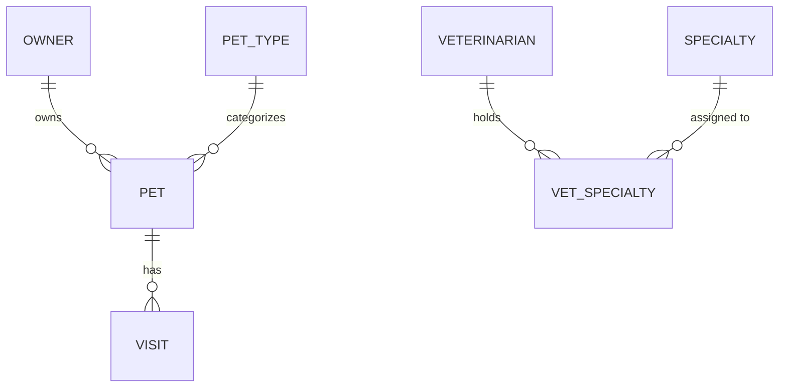

# Entity Model

## Entity Relationship Diagram

*Clinic User accounts are managed entirely in Amazon Cognito (architecture.md §2.5) and are not modeled here — this
diagram covers only entities persisted in Aurora PostgreSQL.*

### OWNER

A pet owner whose contact information and pets are managed by Clinic Users.

| Attribute | Description | Data Type | Length/Precision | Validation Rules |
|-----------|-------------|-----------|-------------------|-------------------|
| id | Unique identifier | Long | 19 | Primary Key, Sequence |
| first_name | Owner's first name | String | 50 | Not Null |
| last_name | Owner's last name; matched case-sensitively on prefix search (UC-004) | String | 50 | Not Null |
| address | Street address | String | 255 | Not Null |
| city | City of residence | String | 80 | Not Null |
| telephone | Contact phone number | String | 10 | Not Null, Format: Phone (10 digits) |

### PET

A pet belonging to exactly one owner.

| Attribute | Description | Data Type | Length/Precision | Validation Rules |
|-----------|-------------|-----------|-------------------|-------------------|
| id | Unique identifier | Long | 19 | Primary Key, Sequence |
| name | Pet's name | String | 50 | Not Null |
| birth_date | Date of birth | Date | - | Not Null |
| owner_id | Owning owner | Long | 19 | Not Null, Foreign Key (OWNER.id) |
| pet_type_id | Pet's type/species | Long | 19 | Not Null, Foreign Key (PET_TYPE.id) |

**Constraints:** `(owner_id, name)` must be unique case-insensitively (UC-007/UC-008 BR-001). `birth_date` must not be
later than the current date (UC-007/UC-008 BR-002).

### PET_TYPE

A reference/lookup category of pet (e.g., dog, cat, hamster).

| Attribute | Description | Data Type | Length/Precision | Validation Rules |
|-----------|-------------|-----------|-------------------|-------------------|
| id | Unique identifier | Long | 19 | Primary Key, Sequence |
| name | Type name | String | 50 | Not Null, Unique |

### VISIT

A single veterinary visit recorded for a pet.

| Attribute | Description | Data Type | Length/Precision | Validation Rules |
|-----------|-------------|-----------|-------------------|-------------------|
| id | Unique identifier | Long | 19 | Primary Key, Sequence |
| pet_id | Pet visited | Long | 19 | Not Null, Foreign Key (PET.id) |
| visit_date | Date of the visit; defaults to today (UC-009 BR-002) | Date | - | Not Null |
| description | Reason or notes for the visit | String | 500 | Not Null |

### VETERINARIAN

A veterinary professional employed at the clinic, listed in the public directory.

| Attribute | Description | Data Type | Length/Precision | Validation Rules |
|-----------|-------------|-----------|-------------------|-------------------|
| id | Unique identifier | Long | 19 | Primary Key, Sequence |
| first_name | Veterinarian's first name | String | 50 | Not Null |
| last_name | Veterinarian's last name | String | 50 | Not Null |

### SPECIALTY

A medical specialty (e.g., surgery, dentistry) that a veterinarian may hold.

| Attribute | Description | Data Type | Length/Precision | Validation Rules |
|-----------|-------------|-----------|-------------------|-------------------|
| id | Unique identifier | Long | 19 | Primary Key, Sequence |
| name | Specialty name; listed alphabetically per vet (UC-002 BR-002) | String | 50 | Not Null, Unique |

### VET_SPECIALTY

The join entity linking veterinarians to the specialties they hold (many-to-many).

| Attribute | Description | Data Type | Length/Precision | Validation Rules |
|-----------|-------------|-----------|-------------------|-------------------|
| vet_id | Veterinarian holding the specialty | Long | 19 | Primary Key, Foreign Key (VETERINARIAN.id) |
| specialty_id | Specialty held | Long | 19 | Primary Key, Foreign Key (SPECIALTY.id) |

**Constraints:** `(vet_id, specialty_id)` forms the composite primary key — a veterinarian cannot be assigned the
same specialty twice.
